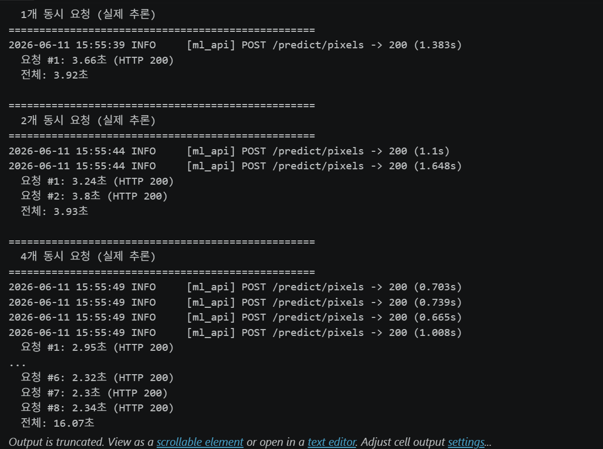
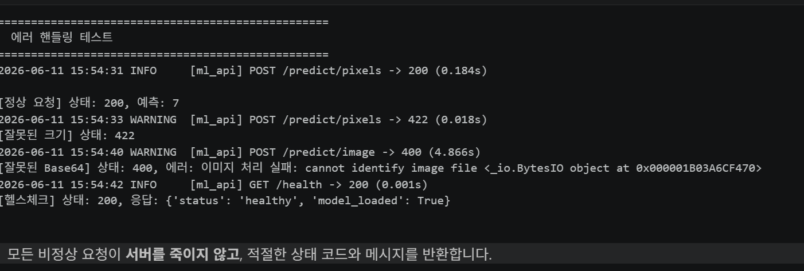

# Day 3 — 비동기 처리와 에러 핸들링


> 제출 항목
> 1. 섹션 1.5 수행내역 캡쳐(수행내역 없음)
> 2. 섹션 2, 3 셀 출력
> 3. 섹션 5 수행내역 캡쳐
> 4. 각 섹션 체크포인트의 답변


## 2. 섹션 2 셀 출력 — Async/Await 의 기본원리

### 2.2 동기 vs 비동기 실행시간 비교

```text
===== 동기 실행 =====
  [작업A] 시작
  [작업A] 완료 (2초)
  [작업B] 시작
  [작업B] 완료 (2초)
  [작업C] 시작
  [작업C] 완료 (2초)

총 소요 시간: 6.0초
```
===== 비동기 실행 =====
  [작업A] 시작
  [작업B] 시작
  [작업C] 시작
  [작업A] 완료 (2초)
  [작업B] 완료 (2초)
  [작업C] 완료 (2초)

총 소요 시간: 2.0초
```


## 3. 섹션 3 셀 출력 — 문제시연:동기추론이 서버를 멈추는 시간

### 3.1 실험설계

```text
서버 실행됨: http://127.0.0.1:8000
<uvicorn.server.Server at 0x1b01cbbd6d0>
```

### 3.2 실험1 동시 요청 시 blocking 엔드포인트의 문제

```
=======================================================
  3개 동시 요청 → http://localhost:8000/predict/blocking
=======================================================
  요청 #1: 5.2초
  요청 #2: 8.2초
  요청 #3: 11.2초

  전체 소요 시간: 11.2초
```

### 3.3 실험2 threadpool 엔드포인트와 비교

```=======================================================
  3개 동시 요청 → http://localhost:8000/predict/threadpool
=======================================================
  요청 #1: 5.1초
  요청 #2: 5.1초
  요청 #3: 5.1초

  전체 소요 시간: 5.1초

```

### 3.4 실험3 blocking이 헬스체크까지 막는 현상

```
===== /predict/blocking 중 헬스체크 =====
  추론 응답: 5.1초
  헬스체크 응답: 4.6초    ← 단순 상태 확인인데 2.5초 대기!

===== /predict/threadpool 중 헬스체크 =====
  추론 응답: 5.1초
  헬스체크 응답: 2.0초    ← 즉시 응답!
```

## 4. 섹션 4 셀 출력 — run_in_excutor로 블로킹 방지하기
### 4.2 실습:세 가지 버전 비교

```
  서버 실행됨: http://127.0.0.1:8000
<uvicorn.server.Server at 0x1b01cbb4f10>

```


```
==================================================
버전 1: async def + time.sleep (blocking)
==================================================
  요청 #1: 5.1초
  요청 #2: 11.1초
  요청 #3: 8.1초
  전체: 11.1초

```


```

==================================================
버전 2: 일반 def (FastAPI 자동 스레드풀)
==================================================
  요청 #1: 5.2초
  요청 #2: 5.2초
  요청 #3: 5.2초
  전체: 5.2초
```

```

==================================================
버전 3: async def + run_in_executor (권장)
==================================================
  요청 #1: 5.2초
  요청 #2: 5.2초
  요청 #3: 5.2초
  전체: 5.2초

```

### 4.5 스레드풀 크기 가이드


```
CPU 코어 수: 8
권장 max_workers (CPU 추론): 8
권장 max_workers (GPU 추론): 1~2

```


## 5. 섹션 5 수행내역 캡쳐 — 에러 핸들링과 로깅

> 
> 
> .png)
> 


## 6. 섹션 6 수행내역 캡쳐 — 실습:최종 서버 + 동시 요청 테스트
### 6.2 서버 실행 및 테스트





### 6.3 에러 핸들링 동작 확인




## 7. 각 섹션 체크포인트의 답변


### 섹션 2
1. time.sleep()은 스레드를 멈추고, await asyncio.sleep()은 현재 코루틴만 멈추며
  이벤트 루프에 제어권을 넘긴다.
2. 모델 추론 같은 CPU/GPU 연산은 대기(IO)가 아니라 계산이므로 중간에 await가 없다. 따라서 async/await만으로는 
  병렬 실행되지 않으며, 실제 동시 처리를 위해서는 스레드, 프로세스, GPU 작업 큐 등의 별도 병렬화 방식이 필요하다.


### 섹션 3
1. async def 자체가 비동기인 것이지, 함수 안의 모든 코드가 자동으로 비동기가 되는 것은 아닙니다.

2. FastAPI(정확히는 Starlette)는 def 엔드포인트를 발견하면 스레드풀(ThreadPoolExecutor) 에서 실행합니다.

3. 헬스체크(Liveness Probe) 응답이 실패하면 인프라는 해당 서버를 '죽은 상태'로 판단합니다. 쿠버네티스 문서에 
   명시된 대로 시스템은 컨테이너를 강제로 종료하고 재시작(Restart) 시킵니다.하나의 서버가 재시작되는 동안 
   남아있는 다른 서버들로 트래픽이 몰립니다. 남은 서버들도 늘어난 추론 요청을 감당하지 못해 헬스체크가 막히고, 
   차례대로 다운되면서 서비스 전체가 마비됩니다.


### 섹션 4
1. run_in_executor가 이벤트 루프 블로킹을 방지하는 원리는 무엇입니까?
   CPU 연산이나 동기 IO 작업을 이벤트 루프가 있는 메인 스레드가 아닌, 별도의 스레드나 프로세스 풀(Executor)로 
   넘겨서 처리하기 때문입니다.
2. run_in_executor의 첫 번째 인자에 None을 넣으면 어떤 스레드풀이 사용됩니까?
   루프의 기본 스레드풀인 ThreadPoolExecutor가 자동으로 사용됩니다.
   
3. 일반 def와 async def + run_in_executor의 핵심 차이는 무엇입니까?
   일반 def는 작업을 마칠 때까지 이벤트 루프 전체를 멈추게(Blocking) 만들지만, async def + run_in_executor는
   작업을 다른 스레드에 비동기로 위임하므로 이벤트 루프가 멈추지 않고 다른 요청을 계속 처리(Non-blocking)할 수 있습니다.
   
4. GPU 추론 시 스레드풀 크기를 1~2로 제한하는 이유는 무엇입니까?
   GPU는 대량의 병렬 연산을 수행하므로 여러 스레드가 동시에 요청을 보내면 GPU 메모리(VRAM) 고갈(OOM)이 발생하거나, 
   컨텍스트 스위칭으로 인해 오히려 추론 속도가 저하될 수 있기 때문입니다.


### 섹션 5
1. 글로벌 Exception Handler를 사용하면 어떤 반복을 줄일 수 있습니까?
   모든 API 엔드포인트(또는 함수)마다 개별적으로 작성해야 했던 try-except 블록의 중복 정의를 줄이고, 에러 응답 
   포맷을 만드는 코드를 하나로 통합할 수 있습니다.

2. 클라이언트에게 스택 트레이스를 노출하면 안 되는 이유는 무엇입니까?
   내부 코드 구조, 사용 중인 라이브러리 버전, 데이터베이스 스키마, 파일 경로 같은 민감한 시스템 보안 정보가 노출되어 
   해킹 공격의 빌미를 제공할 수 있기 때문입니다.
   
3. logging 모듈이 print() 보다 나은 점은 무엇입니까?
   로그 레벨(DEBUG, INFO, ERROR 등)에 따른 출력 제어, 로그 생성 시간 및 위치 자동 기록, 콘솔 외에 파일이나 
   외부 시스템으로 로그를 보내는 출력 방향(Handler) 설정이 가능하기 때문입니다.


### 섹션 6(최종 체크포인트)
   
1. 동기 서버에서 3초 걸리는 추론을 3명이 동시에 요청하면 총 몇 초 걸립니까?
   9초가 걸립니다. 동기 서버는 요청을 순차적으로 처리하므로, 앞선 요청이 끝날 때까지 다음 요청들이 대기합니다.
   
2. time.sleep(3)과 await asyncio.sleep(3)의 핵심 차이는?
   time.sleep(3): 현재 스레드 전체를 멈추게 하는 블로킹(Blocking) 함수입니다.
   await asyncio.sleep(3): 제어권을 이벤트 루프에 양보하여 다른 작업을 처리할 수 있게 하는 논블로킹(Non-blocking) 함수입니다.
   
3. async def 안에서 동기 블로킹 코드를 실행하면 왜 헬스체크까지 영향받습니까?
   싱글 스레드로 동작하는 이벤트 루프 자체가 동기 블로킹 코드에 의해 완전히 멈추기 때문에, 헬스체크 요청을 수신하거나
    응답할 수 없게 됩니다.
    
4. run_in_executor가 이벤트 루프 블로킹을 방지하는 원리는?
   블로킹이 발생하는 동기 작업을 이벤트 루프 메인 스레드가 아닌, 별도의 스레드나 프로세스 풀로 넘겨서 비동기적으로 처리하기 때문입니다.
   
5. 글로벌 Exception Handler를 사용하는 이유는?
   모든 API 엔드포인트마다 개별적으로 작성하던 중복된 예외 처리(try-except) 코드를 한곳으로 모아 관리 효율성을 높이고 에러 응답 포맷을 
   통일하기 위함입니다.
   
6. 클라이언트에게 스택 트레이스를 노출하면 안 되는 이유는?
   내부 소스 코드 구조, 프레임워크 버전, DB 경로 등 민감한 시스템 정보가 드러나 보안 취약점을 공격당할 위험이 커지기 때문입니다.