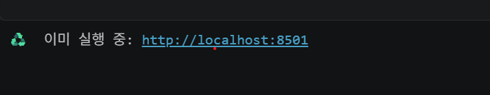
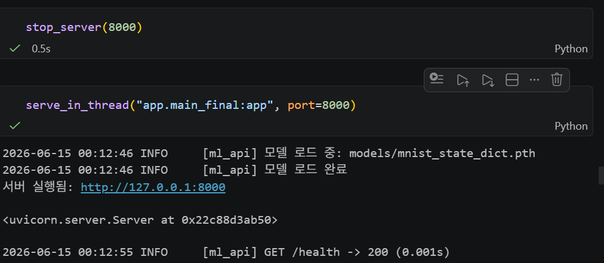

# Day 4 — Streamlit & System


> 제출 항목
> 1. 섹션 5 수행내역 캡쳐
> 2. 각 섹션 체크포인트의 답변


## 1. 섹션 5 수행내역 캡쳐
### 5.3 실행 및 테스트 
  <step1> 백엔드 서버 실행


```


```

  <step2> 프론트엔드 실행

```


```

  <step3> 테스트 시나리오
테스트1

```

```

테스트2

```


```

테스트3

```



```

## 2. 각 섹션 체크포인트의 답변


### 섹션 1
1. Streamlit의 스크립트 재실행(rerun) 모델이란 Streamlit은 사용자와 상호작용이 발생할 때마다 스크립트를 위에서 아래까지 다시 실행합니다.
버튼 클릭, 입력값 변경 등이 모두 재실행 트리거입니다. 상태를 유지하려면 st.session_state를 사용합니다.
2. st.text_input()에 값을 입력하면 입력값이 브라우저에서 서버로 전송됩니다.
해당 위젯의 상태가 업데이트됩니다. Streamlit이 전체 스크립트를 다시 실행합니다.
재실행 시 st.text_input()은 새 값을 반환합니다.
3. st.set_page_config()를 스크립트 중간에 호출하면 오류가 발생합니다.
st.set_page_config()는 반드시 첫 번째 Streamlit 명령 중 하나로, 보통 파일 맨 위에서 호출해야 합니다.
이미 다른 Streamlit 요소가 렌더링된 뒤 호출하면 예외가 발생합니다.

### 섹션 2
1. st.file_uploader()로 업로드된 파일은 getvalue()로 바이트 데이터 획득

2. STreamlit에서 @st.cache_resource를 사용하는 이유는 DB 연결·모델 같은 무거운 객체를 재사용하기 위해 사용


### 섹션 3
1. 모놀리식은 UI와 모델이 한 애플리케이션에 함께 존재하고, 분리 아키텍처는 UI와 모델 서버가 독립적으로 동작합니다.
2. 모델 업데이트 시 재배포 대상으로 분리 아키텍처에서는 모델 서버만 재배포하면 됩니다. (Streamlit 앱은 그대로 유지)
3. Streamlit 앱에 PyTorch가 없어도 되는 이유
추론을 직접 하지 않고 별도의 모델 API 서버에 요청만 보내기 때문입니다. PyTorch는 모델 서버에만 설치되어 있으면 됩니다.
   


### 섹션 4
1. 이미지를 Base64로 인코딩하는 이유
이미지 파일은 바이너리 데이터인데, HTTP API의 JSON은 기본적으로 텍스트만 전송할 수 있습니다. 그래서 이미지를 Base64 문자열로 변환하여 JSON 안에 넣어 안전하게 전송합니다.
2. response.raise_for_status()의 역할
API 요청 결과가 오류(예: 404, 500 등)일 경우 예외(Exception)를 발생시킵니다.
오류를 즉시 확인하고 처리할 수 있게 해줍니다.


### 섹션 5(최종 체크포인트)
   
Q1. Streamlit의 스크립트 재실행 모델이란?

→ 사용자가 버튼 클릭, 입력 등 상호작용을 할 때마다 스크립트 전체를 처음부터 다시 실행하는 방식입니다.

Q2. @st.cache_resource를 사용하는 이유는?

→ 모델, DB 연결 등 생성 비용이 큰 객체를 재사용하여 속도를 높이기 위해서입니다.

Q3. 프론트엔드와 백엔드를 분리하는 핵심 이유 2가지는?

→ 유지보수성 향상과 확장성(재사용성) 확보입니다.

Q4. Streamlit 앱에 PyTorch가 필요 없는 이유는?

→ 모델 추론을 외부 API 서버가 담당하므로 Streamlit은 결과만 받아 표시합니다.

Q5. API 호출 실패 시 사용자에게 스택 트레이스가 아닌 메시지를 보여줘야 하는 이유는?

→ 사용자 경험을 개선하고 내부 시스템 정보를 노출하지 않기 위해서입니다.

Q6. st.session_state에 결과를 저장하는 이유는?

→ 재실행되어도 결과와 상태를 유지하기 위해서입니다.

Q7. 이미지를 API로 전달할 때 Base64 인코딩이 필요한 이유는?

→ 이미지를 텍스트 형태로 변환하여 JSON으로 안전하게 전송하기 위해서입니다.