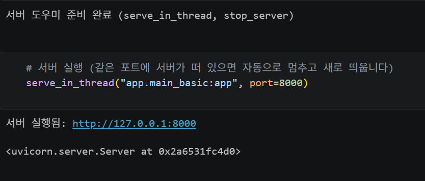
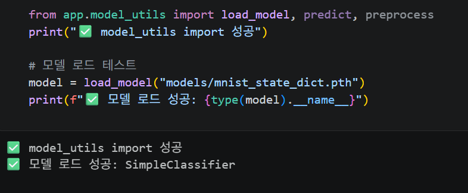

# Day 2 — FastAPI 기초와 데이터 처리


> 제출 항목
> 1. 섹션 1.5 수행내역 캡쳐
> 2. 섹션 2, 3 셀 출력
> 3. 섹션 5 수행내역 캡쳐
> 4. 각 섹션 체크포인트의 답변

---

## 1. 섹션 1.5 수행내역 캡쳐 — 최소 FastAPI 서버 실행

> 
>
> 
> 
> 


```text
# 서버 실행 셀
서버 실행됨: http://127.0.0.1:8000
<uvicorn.server.Server object>

#헬스체크 엔드포인트 호출
상태 코드: 200
응답: {'status': 'healthy'}


# 루트 엔드포인트 호출
상태 코드: 200
응답: {'message': 'ML Model Serving API', 'docs_url': '/docs'}
```

## 2. 섹션 2 셀 출력 — Path, Query, Body 파라미터

### 2.2 Path 파라미터 (`GET /models/{model_name}`)

```text
{'model_name': 'sentiment-v1', 'status': 'running', 'version': '1.0.0'}
{'model_name': 'image-classifier', 'status': 'running', 'version': '1.0.0'}
```

### 2.2 타입 지정 효과 (`GET /predictions/{prediction_id}`, int)

```text
상태: 200, 응답: {'prediction_id': 42, 'label': '긍정', 'confidence': 0.92}
상태: 422
에러: {'detail': [{'type': 'int_parsing', 'loc': ['path', 'prediction_id'],
        'msg': 'Input should be a valid integer, unable to parse string as an integer',
        'input': 'abc'}]}
```

### 2.3 Query 파라미터 (`GET /models?status=&limit=`)

```text
전체 모델: {'total': 3, 'models': [{'name': 'sentiment-v1', 'status': 'running'},
            {'name': 'image-clf-v2', 'status': 'running'}, {'name': 'ner-v1', 'status': 'stopped'}]}
running만:  {'total': 2, 'models': [{'name': 'sentiment-v1', 'status': 'running'},
            {'name': 'image-clf-v2', 'status': 'running'}]}
running, 1개만: {'total': 1, 'models': [{'name': 'sentiment-v1', 'status': 'running'}]}
```

### 2.4 Request Body (`POST /predict`)

```text
기본 응답: {'label': '긍정', 'confidence': 0.92, 'probabilities': None}
확률 포함: {'label': '긍정', 'confidence': 0.92,
            'probabilities': {'긍정': 0.92, '부정': 0.05, '중립': 0.03}}
```

### 2.4 잘못된 요청 테스트 (검증 실패)

```text
상태: 422
에러: Field required
상태: 422
에러: Input should be a valid string
```

---

## 3. 섹션 3 셀 출력 — Swagger UI / OpenAPI

### 3.4 자동 생성된 OpenAPI 스펙

```text
API 제목: Parameter Examples
API 버전: 0.1.0

등록된 엔드포인트:
  GET    /models/{model_name}
  GET    /predictions/{prediction_id}
  GET    /models
  POST   /predict
```

### 3.4 `PredictRequest`의 JSON Schema

```json
{
  "properties": {
    "text": { "type": "string", "title": "Text" },
    "return_probabilities": {
      "type": "boolean",
      "title": "Return Probabilities",
      "default": false
    }
  },
  "type": "object",
  "required": ["text"],
  "title": "PredictRequest"
}
```

### 3.6 ReDoc 문서 접근 확인

```text
상태: 200
내용 길이: 902
```


## 4. 섹션 5 수행내역 캡쳐 — 모델 추론 엔드포인트 구현 및 테스트

>
> 


### Step 1 — model_utils 로드

```text
✅ model_utils import 성공
✅ 모델 로드 성공: SimpleClassifier
```

### Step 4 — 서버 실행 / 헬스체크

```text
✅ 모델 로드 완료
서버 실행됨: http://127.0.0.1:8000

# GET /health
상태 코드: 200
응답: {'status': 'healthy', 'model_loaded': True}
```

### Step 4 — 단일 추론 (`POST /predict`)

```text
이미지 크기: torch.Size([1, 28, 28])
정답 레이블: 7
픽셀 값 개수: 784

상태 코드: 200
응답:
{
  "label": 7,
  "confidence": 1.0,
  "probabilities": null,
  "model_version": "1.0.0"
}
```

### Step 4 — 확률 분포 포함 응답

```text
예측: 7 (확신도: 1.0)

클래스별 확률:
  0: 0.0000
  ...
  7: 1.0000 ██████████████████████████████████████████████████
  ...
```

### Step 4 — 10개 이미지 연속 테스트

```text
이미지      정답     예측     확신도        결과
---------------------------------------------
  #0     7      7      1.0        ✅
  #1     2      2      1.0        ✅
  #2     1      1      1.0        ✅
  #3     0      0      1.0        ✅
  #4     4      4      0.9999     ✅
  #5     1      1      1.0        ✅
  #6     4      4      0.9994     ✅
  #7     9      9      0.9998     ✅
  #8     5      5      0.999      ✅
  #9     9      9      0.9996     ✅

정확도: 10/10 (100%)
```

### Step 5 — 에러 상황 테스트

```text
# 784개가 아닌 100개만 전송
상태 코드: 422
에러 메시지: List should have at least 784 items after validation, not 100

# 숫자가 아닌 문자열 전달
상태 코드: 422

# pixel_values 없이 요청
상태 코드: 422
에러: Field required
```

---

## 5. 각 섹션 체크포인트의 답변

### 섹션 1 

1. FastAPI가 Flask보다 모델 배포에 적합한 이유 세 가지는?
- Pydantic 기반 **자동 입력 데이터 검증** — 타입/필수값/범위를 선언만 하면 잘못된 요청을 자동으로 422로 거부합니다.
- **자동 API 문서화(Swagger UI / ReDoc)** — 코드에서 OpenAPI 스펙이 자동 생성되어 문서가 항상 코드와 동기화됩니다.
- **비동기(async/await) 지원** — I/O 대기 동안 다른 요청을 처리해 높은 동시 처리 성능을 냅니다.

2. Uvicorn의 역할과 FastAPI와 함께 쓰는 이유는?
Uvicorn은 ASGI 서버로, 클라이언트의 HTTP 요청을 받아 FastAPI 앱(ASGI 애플리케이션)에 전달하고 응답을 돌려줍니다. FastAPI 자체는 앱 프레임워크일 뿐 직접 네트워크 요청을 받지 못하므로, 이를 구동할 ASGI 서버인 Uvicorn이 필요합니다.

3. `@app.get("/health")`에서 `get`과 `"/health"`의 의미는?
- `get` → HTTP 메서드(GET). 이 엔드포인트가 GET 요청에 응답함을 의미합니다.
- `"/health"` → 경로(path). `/health` URL로 들어온 요청을 이 함수가 처리합니다.

4. FastAPI에서 dict를 반환하면 자동으로 일어나는 일은?
반환한 dict가 자동으로 JSON으로 직렬화되고, 응답 헤더 `Content-Type: application/json`이 설정되며, 상태 코드 200으로 클라이언트에 전송됩니다. (수동 `json.dumps`가 불필요)

---

### 섹션 2 

1. `/models/sentiment-v1`에서 `sentiment-v1`은?
URL 경로에 포함된 값이므로 "Path 파라미터" 입니다.

2. `/models?status=running&limit=5`에서 `status`, `limit`은?
`?` 뒤에 `key=value` 형태로 붙는 "Query 파라미터" 입니다.

3. 모델 추론 요청에 Request Body를 쓰는 이유는?
추론 입력은 길고 구조화된 데이터(예: 784개의 픽셀 값, 긴 텍스트)이며, URL에 담기에는 부적절하고 길이 제한도 있습니다. JSON 본문(Body)으로 보내면 복잡한 중첩 구조와 대용량 데이터를 안전하게 전달하고 Pydantic으로 검증할 수 있습니다.

4. 파라미터가 Path/Query/Body 중 어디서 오는지 FastAPI가 판별하는 방법은?
- 함수 인자 이름이 경로(`{...}`)에 있으면 → "Path"
- 단순 타입(int, str 등)이고 경로에 없으면 → "Query"
- Pydantic `BaseModel` 타입이면 → "Body"

---

### 섹션 3 

1. Swagger UI 접속 URL은?
`http://127.0.0.1:8000/docs`

2. Swagger UI가 항상 코드와 동기화되는 이유는?
문서를 따로 작성하는 것이 아니라, FastAPI가 엔드포인트 정의와 Pydantic 스키마로부터 "OpenAPI 스펙을 런타임에 자동 생성" 하기 때문입니다. 코드가 바뀌면 스펙도 자동으로 바뀝니다.

3. `Field(description=, examples=)`는 Swagger UI 어디에 반영되나?
- `description` → 각 필드 설명란
- `examples` → "Try it out"의 요청 본문 예시 값(example value)

4. Swagger UI와 ReDoc의 핵심 차이는?
Swagger UI(`/docs`)는 "인터랙티브" 문서로 브라우저에서 직접 요청을 보내 테스트할 수 있습니다. ReDoc(`/redoc`)은 "읽기 전용"으로, 보기 좋게 정리된 정적 문서에 가깝습니다.

---

### 섹션 4

1. `text: str`과 `text: str = "기본값"`의 차이는?
- `text: str` → **필수** 필드. 누락 시 422 에러.
- `text: str = "기본값"` → **선택** 필드. 값이 없으면 기본값 사용.

2. `Field(..., min_length=1, max_length=5000)`에서 `...`의 의미는?
`...`(Ellipsis)는 "필수 필드" 임을 뜻합니다. 기본값이 없으므로 값이 반드시 제공되어야 합니다.

3. 422 에러 응답의 `loc` 필드가 담는 정보는?
오류가 발생한 "위치(location)" 입니다. 예: `["body", "pixel_values"]`, `["path", "prediction_id"]` 처럼 어느 영역(body/path/query)의 어떤 필드에서 검증이 실패했는지를 알려줍니다.

4. `response_model`을 지정하면 얻는 이점은?
- 응답 데이터의 "검증·직렬화" 가 스키마대로 보장됨
- 스키마에 없는 필드는 "자동 제거"되어 민감 데이터 노출 방지
- Swagger UI에 "응답 형식이 문서화" 됨

---

### 섹션 5  (Day 2 종합)

1. 모델을 서버 시작 시 한 번만 로드해야 하는 이유는?
모델 로드는 수 초가 걸리는 무거운 작업입니다. 요청마다 로드하면 매 요청이 느려집니다. 모듈 레벨에서 한 번만 로드해 메모리에 올려두면, 이후 요청은 로드된 모델을 재사용해 빠르게 추론합니다.

2. `pixel_values`가 784개가 아닌 요청이 오면 직접 처리 코드를 작성했는가?
`schemas.py`의 `PredictRequest`에서 `Field(..., min_length=784, max_length=784)`로 길이를 제한했습니다. 784개가 아니면 Pydantic이 자동으로 "422" 에러값을 반환합니다. (실제 테스트: 100개 전송 시 `List should have at least 784 items after validation, not 100`)

3. `HTTPException(status_code=503)`은 어떤 상황에서? 왜 500이 아니라 503인가?**
모델 로드에 실패해 `model_loaded`가 `False`일 때 사용합니다. 503(Service Unavailable)은 "서버가 일시적으로 요청을 처리할 수 없음"을 의미합니다. 코드 자체의 버그(500, Internal Server Error)가 아니라 "모델이라는 의존 리소스가 아직 준비되지 않은 상태"이므로 503이 더 정확한 의미를 전달합니다.

4. Swagger UI에서 `PredictRequest`의 description과 examples는 어디에 표시되나?
`/docs`에서 해당 엔드포인트(`POST /predict`)를 펼치면 Request body 스키마의 각 필드에 `description`이 설명으로, `examples`가 요청 본문 예시(Example Value)로 표시됩니다.
